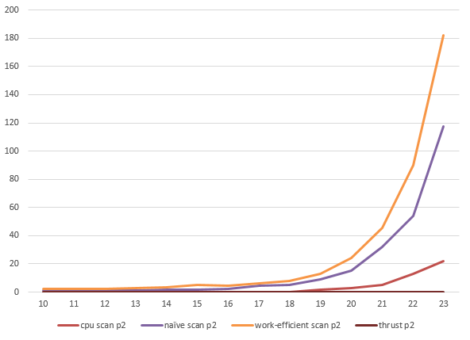

CUDA Stream Compaction
=================

**University of Pennsylvania, CIS 565: GPU Programming and Architecture, Project 2**

* Shuai Shao (Shrek)
* Tested on: Windows 7, i5-3210M @ 2.50GHz 4.00GB, GeForce GT 640M LE (Personal Laptop)

Intro
---------------------
This project implements parallel reduction, scan, and sort algorithm, which are building blocks for many algorithms, in cpu approach and gpu approach. The test program is able to generate random array of integers and test the correctness of these implementation, and make a comparison in terms of execution time. cpu time is currently measured by `clock_t`, while the gpu time is recorded via `cudaEvent`

| | 
| ------------- | ------------- | ----------------|
| cpu scan | 
| naive scan|
| work-efficient scan| 
| thrust scan| 
| ------| ----------------|-------|
|cpu compact without scan|
|cpu compact with scan|
|work-efficient compact|


I also implemented a simple version of Radix. Due to time limitation, there's no shared memory usage. So no split and merge steps. Only global memory is used. 
| |
| ------------- | ------------- | ----------------|
|cpu merge sort|
|radix sort|


Rough block size optimization
-----------------------------------

Testing on a 2^16 array for block size `{64,128,192,256}`. When `blockSize=192` turns out every GPU function cost less time than other blockSizes. Here is some of the comparison (ms):
|-|naive scan| work-efficient scan|thrust scan|work-efficient compact
| ------------- | ------------- | ----------------|
|64|3.12|5.76|0.00128|6.32
|128|2.38|3.94|0.00131|5.54
|192|2.11|3.89|0.00128|4.97
|256|2.90|4.09|0.00131|6.72


Execution Time Analysis
---------------------------------

For this part, I have `blockSize = 192` constant. I test different cpu and gpu approaches on different data size. I have included the time for GPU global memory operation such as `cudaMalloc` and `cudaMemcpy`. 

+ Scan:


+ Compaction:


(array size = 2^n (x axis))
(execution time = y axis)

The unexpected thing is that my GPU implementation cost much more time than the CPU serial approach. On the other hand, the thrust toolkit function is perfect. 
One thing to notice is that all the GPU parallel algorithms here use shared memory instead of global memory I used here. Shared memory accessing speed is >1TB/s while global memory accessing speed is around 150GB/s. In the case of my machine, the 48KB shared memory space per block can store 12k int array at maximum. Turns out the memory accessing speed is the bottle neck for my implementation. On the time line we can also spot this.
Another thing is that when using global memory, as the data size boom, some blocks can not be parallel any more.

Besides, it is also unexpected that work-efficient scan runs slower than the naive one. My implementation has tried the best to reduce unnecessary memcpy and malloc, i.e. I use two arrays taking turns to be input data and output data by using two points `cur_in` and `cur_out` for the naive scan. I use only one array for work-efficient scan since there's no race on the same level. So basically the problem here is that although work-efficient scan avoid a lot of unnecessary sum operations, the work-efficient scan uses more memory access than the naive approach. The max memory access times per thread for naive scan is 3, while for work-efficient scan, the number is 3 for up-sweeping, and 5 for down-sweeping. Without cache, this is really time-consuming.


But when I check the timeline for thrust, I cannot find function calls but only blank. I fail to find the secret of thrust at present. 


Output Sample
---------------------------
```
ArraySize:2^(16), 65536
BlockSize:192

****************
** SCAN TESTS **
****************
    [  38  19  38  37   5  47  15  35   0  12   3   0  42 ...  35   0 ]
==== cpu scan, power-of-two ====
time:1.000000
    [   0  38  57  95 132 137 184 199 234 234 246 249 249 ... 1604374 1604409 ]
==== cpu scan, non-power-of-two ====
time:0.000000
    [   0  38  57  95 132 137 184 199 234 234 246 249 249 ... 1604305 1604316 ]
    passed 
==== naive scan, power-of-two ====
time:2.123680
    passed 
==== naive scan, non-power-of-two ====
time:2.108992
    passed 
==== work-efficient scan, power-of-two ====
time:3.803328
    passed 
==== work-efficient scan, non-power-of-two ====
time:3.889184
    passed 
==== thrust scan, power-of-two ====
time:0.001312
    passed 
==== thrust scan, non-power-of-two ====
time:0.001280
    passed 

*****************************
** STREAM COMPACTION TESTS **
*****************************
    [   2   3   2   1   3   1   1   1   2   0   1   0   2 ...   1   0 ]
==== cpu compact without scan, power-of-two ====
time:0.000000
    [   2   3   2   1   3   1   1   1   2   1   2   1   1 ...   1   1 ]
    passed 
==== cpu compact without scan, non-power-of-two ====
time:0.000000
    [   2   3   2   1   3   1   1   1   2   1   2   1   1 ...   3   1 ]
    passed 
==== cpu compact with scan ====
time:1.000000
    [   2   3   2   1   3   1   1   1   2   1   2   1   1 ...   1   1 ]
    passed 
==== work-efficient compact, power-of-two ====
time:4.982400
    [   2   3   2   1   3   1   1   1   2   1   2   1   1 ...   1   1 ]
    passed 
==== work-efficient compact, non-power-of-two ====
time:4.974688
    passed 

*****************************
** SIMPLE RADIX SORT TESTS **
*****************************
    [  38  99  29  24  92 113 110  27  36   5  11  33 126 ...  99   0 ]
==== cpu sort, power-of-two ====
time:20.000000
    [   0   0   0   0   0   0   0   0   0   0   0   0   0 ... 126 126 ]
==== radix sort, power-of-two ====
time:30.557344
    [   0   0   0   0   0   0   0   0   0   0   0   0   0 ... 126 126 ]
    passed 

```


Extra: Radix Sort
--------------------------
To enable Radix Sort, you need to uncomment this macro define

>//#define RADIX_SORT_TEST

Due to time limitation, there's no shared memory usage. So no split and bitonic merge steps. Only global memory is used. I used a CPU Merge sort to make a comparison and do correctness checking. The range of the random number is linear to the size of the array.

(time ms)
|n	  |   cpu merge sort	| gpu simple radix  |
| ------------- | ------------- | ------- |
|15|11| 54.683
|16	|21	|71.0747
|17	|56	|95.9559
|18	|102	|166.257
|19	|1200	|281.074
|20	|3793	|532.041
|21	|10227	|1018.44


Turns out even with global memory access and take in account malloc and memcpy, the gpu approach still shows its power after n >=18. With split and shared memory, radix sort must be able to make an impact.


